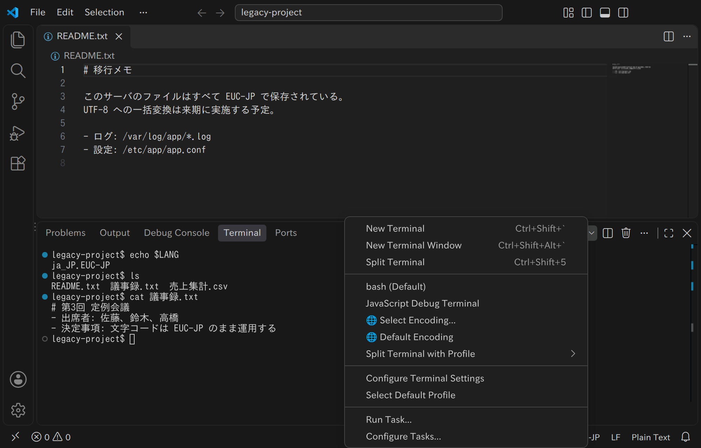

# Terminal Any Encoding

[日本語版はこちら / Japanese version](README.ja.md)

Install from the [Visual Studio Marketplace](https://marketplace.visualstudio.com/items?itemName=yutotnh.terminal-any-encoding) or [Open VSX](https://open-vsx.org/extension/yutotnh/terminal-any-encoding).

Use non-UTF-8 encodings in the VS Code integrated terminal.
All 45 non-Unicode encodings VS Code supports are available, from Western, Central European, Cyrillic, Greek, Turkish, Arabic, Hebrew, Baltic, Thai and Vietnamese to Chinese, Japanese and Korean.
They're the non-Unicode encodings in VS Code's "Reopen with Encoding" list (older VS Code versions lack CP 1125 and CP 857, but this extension offers them on any version).



## Requirements

VS Code 1.73.0 or later.
Supported operating systems (for a remote connection, the remote host's):

| OS      | Support                                   |
| ------- | ----------------------------------------- |
| Linux   | x64 / arm64 / armhf (Alpine: x64 / arm64) |
| macOS   | x64 / arm64                               |
| Windows | Not supported                             |

## Getting Started

To install from the command line:

```sh
code --install-extension yutotnh.terminal-any-encoding
```

Pick an encoding from `🌐 Select Encoding...` in the ▼ next to the `+` button in the terminal panel.

To skip the picker:

- set [`terminalAnyEncoding.defaultEncoding`](#settings) and pick `🌐 Default Encoding`,
- bind a [key](#keybindings), or
- [make it your default terminal](#using-this-extension-as-your-default-terminal).

## Commands

| Command                            | In the dropdown         | Description                                                                         |
| ---------------------------------- | ----------------------- | ----------------------------------------------------------------------------------- |
| `Open Terminal with Encoding...`   | `🌐 Select Encoding...` | Shows the encoding picker. Passing an id (below) as the argument opens it directly. |
| `Open Terminal (Default Encoding)` | `🌐 Default Encoding`   | Opens a terminal with `defaultEncoding`, or shows the picker when it's empty.       |

An id is the same as VS Code's `files.encoding` value (`eucjp`, `shiftjis`, etc.) and is shown next to each label in the picker.

### Keybindings

Pass an id to `terminalAnyEncoding.openTerminal` to open it with one key:

```json
[
  {
    "key": "ctrl+alt+e",
    "command": "terminalAnyEncoding.openTerminal",
    "args": "eucjp"
  },
  {
    "key": "ctrl+alt+s",
    "command": "terminalAnyEncoding.openTerminal",
    "args": "shiftjis"
  }
]
```

## Settings

| Setting                                           | Description                                                                                                                             |
| ------------------------------------------------- | --------------------------------------------------------------------------------------------------------------------------------------- |
| `terminalAnyEncoding.defaultEncoding`             | Encoding used by `🌐 Default Encoding`. Empty (the default) shows the picker each time.                                                 |
| `terminalAnyEncoding.shellProfile.linux` / `.osx` | Profile (a name from `terminal.integrated.profiles.*`) of the shell the terminal starts. Empty (the default) uses your default profile. |
| `terminalAnyEncoding.warnAboutLocale`             | Warn when no matching locale is available (default `true`).                                                                             |

### Using this extension as your default terminal

Set `terminal.integrated.defaultProfile.linux` (`.osx` on macOS) to `🌐 Default Encoding`, and "New Terminal" (Ctrl+Shift+\`) opens this extension's terminal.

```json
{
  "terminalAnyEncoding.defaultEncoding": "eucjp",
  "terminal.integrated.defaultProfile.linux": "🌐 Default Encoding"
}
```

In this case, set the shell to start with `shellProfile.*`.
Without it, `$SHELL` is used (as a login shell on macOS).

```json
{
  "terminalAnyEncoding.shellProfile.linux": "zsh"
}
```

## Locale Detection

Each terminal gets `LANG` set to a locale matching its encoding (e.g. `ja_JP.EUC-JP`).
This makes programs that handle text by locale, like `date` and `ls`, write in that encoding.

If the matching locale isn't installed on the host, a warning names the locale to generate.
"Don't Show Again" or [`warnAboutLocale`](#settings) turns it off.

On Linux, though, glibc's standard locales include none at all for the following encodings.
There's nothing to generate, so no warning is shown for them:

- Shift JIS (unless your distribution adds one like `ja_JP.sjis`)
- Windows 874
- the DOS code pages (CP 437, 850, 852, 857, 865 and 866)

With these, `LANG` keeps the value inherited from VS Code, so `date` and `ls` may display text wrong.

### When your shell's startup file sets `LANG`

If `~/.bashrc` or similar sets `LANG` or `LC_ALL`, it overrides the value this extension sets, and `date` and `ls` display text wrong.
For example, `ls` shows an EUC-JP file name like `$'\244\242'`.
The override happens after the shell starts, so no warning is shown.
Programs that print file contents as-is, like `cat`, aren't affected.

To avoid this, keep a value that's already set:

```sh
export LANG="${LANG:-ja_JP.UTF-8}"
```

## Tasks

A task of type `terminalAnyEncoding` has its input and output converted (problem matchers read the converted output too).
Write it like a `shell` task, plus an `encoding` (an id):

```json
{
  "version": "2.0.0",
  "tasks": [
    {
      "label": "build",
      "type": "terminalAnyEncoding",
      "encoding": "eucjp",
      "command": "make",
      "args": ["all"],
      "problemMatcher": "$gcc"
    }
  ]
}
```

- The command line (including values of variables like `${file}`) is interpreted in the task's encoding.
  So files with non-ASCII UTF-8 names (such as ones created in VS Code) aren't found.
- A command line with a character the encoding can't represent isn't run, and the task fails.

## Shell Integration

Works for bash, zsh, fish and pwsh, as in VS Code's own terminals.

## Known Limitations and Troubleshooting

### Typed input isn't sent

Input with a character the encoding can't represent (e.g. an emoji in an EUC-JP terminal) isn't sent to the terminal.
A notification names the character.
If it was pasted, the rest of the paste isn't sent either: up to the paste's end if the shell uses bracketed paste, otherwise until input pauses, and for 2 seconds at most (a rest arriving later, as it can over a slow remote connection, is sent).

### Mojibake or `�`

First check that the terminal's encoding matches the files or programs you're working with.
If it does, run `locale charmap` in the terminal to check the locale's encoding (see [Locale Detection](#locale-detection)).

### Tab names don't change on macOS

On macOS, a tab's name stays as it started, e.g. `bash (EUC-JP)`.

### Output of other task types and of debug sessions isn't converted

Only this extension's terminals and tasks of type `terminalAnyEncoding` are converted.
A task is converted once it uses the [`terminalAnyEncoding` type](#tasks).
There's no way to convert debug output.

### `～` and `№` typed in EUC-JP become different bytes than the editor saves

`～` and `№` typed in an EUC-JP terminal are sent as `A1 C1` and `AD E2`.
The terminal shows those bytes as `～` and `№`, so what you type matches what's displayed.
These are also the bytes the wave-dash-unify extension saves.
VS Code's editor alone saves `8F A2 B7` and `8F A2 F1` instead, which other tools can't read.

`〜` (U+301C) is sent as the wave dash too: `A1 C1` in EUC-JP and `81 60` in Shift JIS.

## Contributing

See [CONTRIBUTING.md](CONTRIBUTING.md).

## License

MIT.
See [THIRD-PARTY-NOTICES.md](THIRD-PARTY-NOTICES.md) for bundled third-party licenses.
